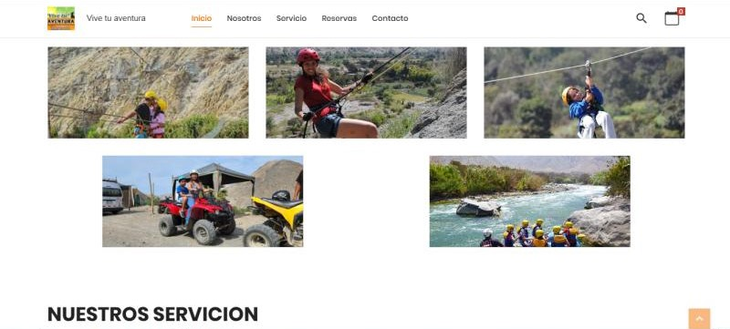

# 🌄 Vive Tu Aventura – Sistema de Gestión de Ventas y Reservas

## 📌 Descripción del Sistema
**Vive Tu Aventura** es un sistema web desarrollado para una agencia de turismo de aventura, orientado a la digitalización y automatización del proceso de ventas, reservas y control operativo del negocio.

El sistema reemplaza procesos manuales como el registro en cuadernos, cálculos de ventas y control de personal, reduciendo errores, mejorando la trazabilidad de la información y optimizando la toma de decisiones del propietario.

---

## 🎯 Objetivo del Sistema
Mejorar el proceso de ventas de la agencia mediante un sistema de gestión que permita un control más rápido, claro y confiable de las operaciones diarias, ventas, clientes y personal.

---

## 🧩 Funcionalidades Principales

### 👥 Gestión de Clientes
- Registro, búsqueda, edición y eliminación de clientes
- Visualización del historial de clientes asociados a ventas

### 💰 Gestión de Ventas
- Registro de ventas de servicios turísticos
- Cálculo automático del total de la venta
- Conteo de ventas diarias y mensuales
- Control de ventas por vendedor
- Búsqueda, edición y eliminación de ventas
- Impresión de boletas

### 📦 Reservas y Servicios
- Registro y gestión de reservas
- Asignación de guías y choferes
- Visualización de grupos y servicios contratados

### 💼 Gestión de Caja
- Registro de apertura de caja
- Registro de cierre de caja
- Historial de movimientos de caja

### 👤 Gestión de Usuarios
- Registro y administración de usuarios
- Inicio de sesión con control de accesos
- Asignación de roles y permisos
- Auditoría de acciones del sistema

---

## ⚙️ Requerimientos No Funcionales
- Interfaz intuitiva y accesible
- Compatibilidad multiplataforma
- Seguridad de datos y control de accesos
- Respaldos de base de datos
- Escalabilidad del sistema
- Tolerancia y recuperación ante fallos
- Facilidad de mantenimiento
- Generación de reportes
- Soporte para futuras ampliaciones

---

## 🧪 Metodología de Desarrollo
El sistema fue desarrollado bajo la **metodología ágil SCRUM**, organizada en sprints que abarcan:
- Análisis de requerimientos
- Planificación del proyecto
- Diseño de la arquitectura y base de datos
- Construcción de funcionalidades
- Pruebas de unidad, integración y aceptación
- Despliegue y capacitación del personal

---

## 🛠️ Tecnologías Utilizadas
- PHP 8.0+
- MySQL
- HTML5
- CSS3
- JavaScript
- Apache (.htaccess)
- Git / GitHub
- JMeter (pruebas)
- Figma (prototipado)

---

## 🔐 Impacto del Sistema
- Reducción de errores en cálculos de ventas
- Mejor control del personal y servicios realizados
- Optimización del tiempo operativo
- Mayor confiabilidad en los registros
- Soporte a la transformación digital del negocio

---

## 🌱 Enfoque Social y Organizacional
El sistema contribuye a una gestión más ordenada, transparente y eficiente, permitiendo al negocio crecer de forma sostenible y mejorar la calidad del servicio brindado a los clientes.
